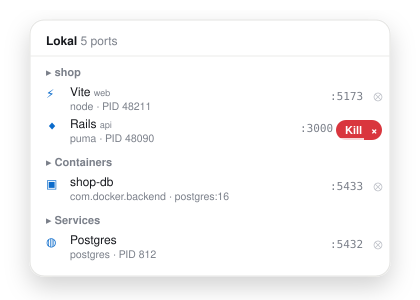

# Lokal

A native macOS menu bar app that shows what is running on localhost.

Click the menu bar icon and Lokal lists every listening port on your machine, the process behind it, and the project it belongs to. It recognises common services (Postgres, Redis, Vite, Next.js, Docker containers, ...) and lets you open, copy, reveal, or kill each one without leaving the menu bar.

Free and open source (MIT). No accounts, no sign-in, no telemetry. The only network traffic is the Sparkle update check.

<p align="center">
  
  <br>
  <sub>Placeholder illustration. A real screenshot lands before 1.0.</sub>
</p>

## Install

Homebrew:

```sh
brew install sigurdarson/tap/lokal
```

Direct download: grab the latest `.dmg` from [lokal.sigurdarson.is/download](https://lokal.sigurdarson.is/download) or the [GitHub Releases](https://github.com/sigurdarson/lokal/releases) page, drag Lokal to Applications, and open it.

Requirements: macOS 15 or later, Apple silicon.

Lokal is signed with a Developer ID and notarized. It runs without the App Sandbox because inspecting other processes' sockets is not possible inside it.

## How it works

Lokal uses the `libproc` APIs (`proc_listpids`, `proc_pidinfo`, `proc_pidfdinfo`) to enumerate listening TCP sockets and the processes that own them. It never shells out to `lsof` or `netstat`. Processes owned by other users (for example root-run daemons) are not visible without elevated privileges, and Lokal does not ask for them.

### Project detection

For each listening process Lokal resolves a project like this:

1. Take the process working directory. If that is unhelpful (for example `/`), look at the parent process chain and at the script path in the command line (a `node_modules/.bin/vite` path points at its project).
2. Walk up from that directory towards your home folder. The nearest manifest gives the display name: `package.json`, `Package.swift`, `Cargo.toml`, `pyproject.toml`, `go.mod`, `Gemfile`, `composer.json`, `mix.exs`, `deno.json`, `pubspec.yaml`, `settings.gradle`, `CMakeLists.txt`, or an Xcode project.
3. The nearest `.git` marks the repository root and is used to group entries. In a monorepo you get `repo / package`.
4. If nothing is found, the directory name is used.

Results are cached per process, so the panel stays cheap to refresh.

macOS may show a one-time permission prompt if a project lives under Desktop, Documents, or Downloads. Lokal only reads manifest files and checks for `.git`.

### Service detection

Well-known services get a friendly label and icon. Definitions live in a single JSON file:

`app/LokalCore/Sources/LokalCore/Services/services.json`

Each entry looks like this:

```jsonc
{
  "id": "postgres",
  "name": "Postgres",
  "kind": "database",
  "icon": "cylinder.split.1x2",
  "ports": [5432],
  "processNames": ["postgres"],
  "commandPatterns": [],
  "urlTemplate": "postgres://localhost:{port}",
  "openInBrowser": false
}
```

Matching order: process name, then command-line pattern, then port. A port-only match is treated as a hint rather than a certainty.

Set `"auxiliary": true` for supporting ports such as debug inspectors.

### What is hidden by default

Lokal is about development work, so each group folds the noise behind a "hidden ports" row: debug inspectors, sockets in the ephemeral range (49152 and up), GUI applications such as Spotify or Raycast, and system daemons. A port stays visible when it belongs to a project, matches a known service, or is published by a container. A setting lists everything instead.

To add a service, append an object to the file and run the tests. A test validates ids, kinds, regexes, and that every icon is a real SF Symbol. See [CONTRIBUTING.md](CONTRIBUTING.md).

### Docker and OrbStack

Ports published by Docker Desktop or OrbStack show the container name. Lokal talks to the local Docker Engine socket directly. This is a Unix socket on your machine, not a network connection.

## Repository layout

This is a monorepo.

| Path | Contents |
|---|---|
| `app/` | The macOS app: an Xcode project plus the `LokalCore` Swift package that holds all logic and tests |
| `web/` | The website at lokal.sigurdarson.is (TanStack Start on Cloudflare Workers), the Sparkle appcast, and the download redirect |
| `homebrew/` | The Homebrew cask. Source of truth, mirrored automatically to [sigurdarson/homebrew-tap](https://github.com/sigurdarson/homebrew-tap) |
| `.github/` | CI and release workflows, issue and PR templates |
| `PLAN.md` | Architecture, decisions, and roadmap |

## Building locally

Requires Xcode 26.6 or later.

```sh
# Core logic and tests
cd app/LokalCore && swift test

# The app
cd app && xcodebuild -scheme Lokal -configuration Debug build
```

If `xcode-select -p` points at the Command Line Tools, prefix commands with `DEVELOPER_DIR=/Applications/Xcode.app`.

Website:

```sh
cd web && pnpm install && pnpm dev
```

## Releases

Tagged releases are built, signed and notarized by GitHub Actions. The same run publishes the GitHub Release, updates the Sparkle appcast and download redirect on the website, and pushes the cask to the tap. See [CONTRIBUTING.md](CONTRIBUTING.md#releasing-maintainers).

## Privacy

Lokal makes no network requests except to `lokal.sigurdarson.is/appcast.xml` for update checks, which you can disable in Settings. Nothing is collected or sent anywhere.

## License

MIT. See [LICENSE](LICENSE).
